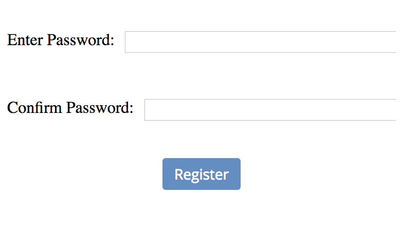

## Password Entry Field Embed Site

This should be hosted on chatbox just as chatbox.com/demo/payment.html is hosted today so that they don’t have to host the embedded site anywhere and can use it at their discretion.


Parameters (order in the url should follow this order):
1. Label -- optional -- the label to be displayed above the text  -- default to “Enter Password”
    * To have no label show, include the label parameter with nothing after the ‘=’
2. Password - optional -- if passed in pre-populate with that text as ******
3. Mask - optional -- character to use for masking -- use * if none provided
4. Width - optional -- CSS styling to apply to the input box -- default to 100% 
5. Callback -- standard callback sending back the plain text password


Specification:
* Max length is 100 characters
* On return or loss of focus, send back the value via the callback
* Instant App author responsible for validation, error messages, etc


### Example
In this example we want two password fields, one for initial entry, the other for confirmation. 



In order to do this put an embedded website element in the Layout, with the following website url:
https://<i></i>chatbox.com/embed/password/password.html?label=Enter%20Password:&mask=*&width=100%25&callback=

For the second password field, make another embedded website element with a similar url. To change the label from 
'Enter Password' to 'Confirm Password', simply change the label parameter in the url from 'label=Enter%20Password' 
to 'label=Confirm%20Password'

To access the return value of the embedded site, a.k.a. the password, write an action handler for the embedded 
site value change. This snippet will look something like:
```javascript
var v = JSON.parse(newValue);
app.setElementValue("password1_label", v.password);
```

The sent back password is then stored in a hidden single line input element, where it can be referenced from other 
snippets to do validation.

