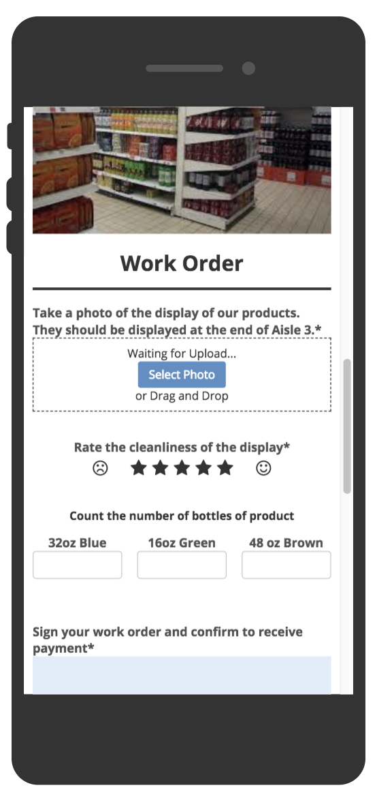

# Starter for Chatbox

Welcome to Chatbox, the worlds leader in customer relations software! 
This guide is intended to help people get off the ground using Chatbox 
how it is intended to be used. This guide assumes you will already 
have access to the home console

## Table of Contents
* [Integrating Twilio](#integrating-twilio) 
* [Making an Instant App](#making-an-instant-app)
* [Add New Interactions to Agent Pool](#handoff-to-user) 
* [Create a FAQ bot](#create-a-faq-bot)
* [Further Readings](#further-readings)


## Integrating Twilio 
#### Adding the Twilio Integration
To be able to text into the channel, first we must bring in the Twilio integration. 
If you already have a Twilio account, grab the sid and auth token from your 
project dashboard. If you do not have an account, you will need to sign up and create a project.
<br><br>
Once you have your SID and Auth Token, click on the integrations button in the Chatbox console. 
Click Twilio to find a page full of ways the Twilio integration will help your organization. 
Click 'Integrate now' to move on to the next pane. Name your integration, and put the SID and Auth Token 
in the corresponding text fields. Click save, and this will unlock the ability to add a number to your channel.
Near the top of the page there will be a slider denoting your integration as inactive. Toggle this slider to 
Active in order to be able to use this integration.

####  Add a Twilio-SMS Number
Adding a channel will open up a way for your customers to interact with you. From the home screen of the console, 
click on channels, then  Add Channel, and finally Twilio-SMS. From your Twilio account, generate a new number. 
<br><br>
Once you have this number simply put that number in the assigned phone number field in the New Twilio-SMS Channel page.
Keep the Name and ID of the channel as they appear; the id will be referenced later in the guide.
Make the channel active and that's it! Your customers will now be able to reach you, but in order for 
you to respond you have two options:
* [Add New Interactions to Agent Pool](#handoff-to-user) 
* [Create a FAQ bot to respond for you](#create-a-faq-bot)

## Making an Instant App


Structured data is a vital part of any customer interaction. Chatbox has made collecting that data easy with 
Instant Apps.
<br><br>
To create an Instant App, click on the Instant App button, and select Add Instant App. From this point you may 
either use a template, import a json schema, or start from scratch. Whatever option you choose, to get the most out of 
your Instant App, you will have to play around with all of the elements/features available.

### Layout
There are many elements available for use in your Instant App. The drag and drop functionality of the 
Instant App Builder allows you to easily play around with the layout to get it just right. Here are some of the 
more commonly used layout elements.

#### Image
As the name suggests, the image tag allows you to upload an image into the Instant App. Try dragging and 
dropping your image for a quick and easy upload! Images can also be styled to affect the margins or the border.

#### Single Line Input
Single Line input fields are text input areas with a label that can be displayed above or inline with the text. 
Virtually any kind of styling you could do with css is available in the styling tab. The Validation tab allows you 
to make the data required, have a minimum/maximum number of characters, match a regular expression, or you can 
write your own custom javascript validation function.

#### Button
Buttons, like all other elements can be styled in the style tab. The real use of buttons will be what event or action 
they trigger when clicked. See the Events and Actions section for more information on that.

#### Label
The Label element is simply a field where text can be displayed using Markdown. This element can be styled in the 
same way most other elements can be.

#### Chart
This element allows to you display a bar chart, pie chart, line chart, or scatter chart. You also have the option 
to display static data from within the element or dynamically display data from a javascript snippet.

### Events & Actions


## Handoff to User 
#### Every New Interaction Go to Agent
If you are using Chatbox as a means for your Agents to interact with customers, you may just want every new 
interaction to go to an Agent Queue. To do this, click into Automations from the home console. 
Click 'Global New Interaction', then 'Add JavaScript Snippet'. 
```javascript
interaction.handoffToUser("email","your@email.com");
```
This function will put the interaction into the agent queue for the agent with the email 
specified in the second parameter. 

#### Have a Bot Handoff to User
One of the things that makes Chatbox so useful is the ability to have a bot handle as many questions as possible 
but if a customer would rather have a human respond, the bot can handoff the interaction to an Agent. 
This portion of the guide requires you to have an FAQ bot already instantiated. If you do not have one, go to the 
[Create a FAQ section](#create-a-faq-bot) and then come back. 
<br> <br>
Having a bot hand off the interaction to an Agent is very simple! Create a new intent titled something like 'Agent'. 
Within this intent, create Sample User Phrases that you would want a customer to ask for an Agent, 
such as 'Get me a Human'. Enable Execute JavaScript, and invoke the interaction.handoffToUser method 
to escalate the interaction to an Agent.


## Create a FAQ bot
The FAQ bot functionality is powered by the Alterra NLP engine. In order to integrate a bot, 
first sign up with Alterra and get the API key associated with your account.
<br><br>
Once you have your API key, click the Automations button on the Chatbox home console. 
Next to the Events tab, click the bots tab. Click Add Bot, then FAQ Bot, and fill out the subsequent fields to 
describe your bot. The API key from Alterra goes in the NLP Key field. 

#### Hello World Intent
In the Training section of your bot, click on 'Add New Intent'. Name this intent 'Hello World'. 
In the Sample User Phrases section, add the phrase, 'hello'. Under the Fulfillment Actions, 
make the Reply, 'world' and save. Now when a customer texts, 'hello' in to your channel, 
your bot will automatically respond, 'world'.


## Further Readings
Congratulations! You now have a channel for customers to interact with your company and a bot to 
automatically respond, with the capabilities to hand off to a human agent or send a customer an Instant App! 
Create more intents to make your bot more useful and informational for your customers. 
<br><br>
To add even more functionality to your system, stand up a node server to receive Web Requests using the 
chatbox.callExternalWebAPI method. More information on that [here](/NodeServers/README.md).